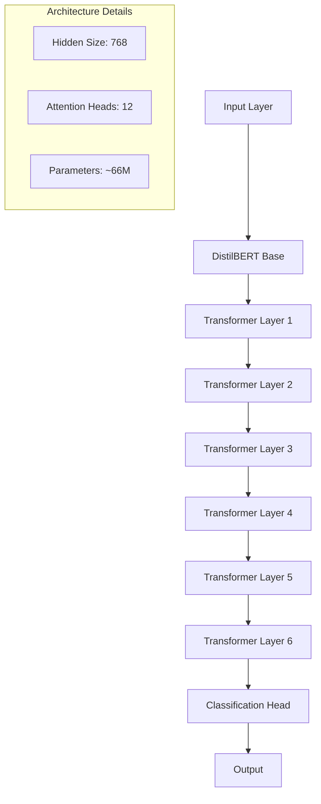
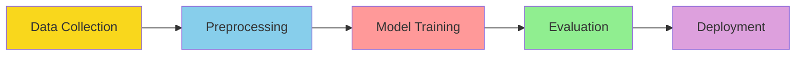
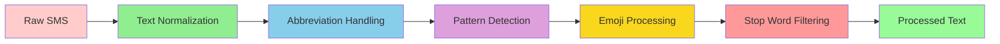

# 🔥 Advanced SMS Spam Detection with DistilBERT

<div align="center">


![PyTorch](https://img.shields.io/badge/PyTorch-2.8.0-ee4c2c?style=f### 🔬 Technical Details

### Model Architecture


```mermaid
graph TD
    A[Input Layer] --> B[DistilBERT Base]
    B --> C[Transformer Layer 1]
    C --> D[Transformer Layer 2]
    D --> E[Transformer Layer 3]
    E --> F[Transformer Layer 4]
    F --> G[Transformer Layer 5]
    G --> H[Transformer Layer 6]
    H --> I[Classification Head]
    I --> J[Output]

    subgraph Architecture Details
    K[Hidden Size: 768]
    L[Attention Heads: 12]
    M[Parameters: ~66M]
    end
```

### Model Size Comparison


```mermaid
pie title Model Size Comparison
    "DistilBERT (Our Model)" : 66
    "BERT Base" : 110
```e&logo=pytorch&logoColor=white)
![Transformers](https://img.shields.io/badge/🤗%20Transformers-4.57.0-ffca28?style=for-the-badge)
![CUDA](https://img.shields.io/badge/CUDA-Compatible-76b900?style=for-the-badge&logo=nvidia)
![License](https://img.shields.io/badge/License-MIT-00d4aa?style=for-the-badge)

![Status](https://img.shields.io/badge/Status-Production%20Ready-success?style=for-the-badge)
![Accuracy](https://img.shields.io/badge/Accuracy-99.28%25-brightgreen?style=for-the-badge)
![F1 Score](https://img.shields.io/badge/F1%20Score-97.35%25-brightgreen?style=for-the-badge)
![Dataset](https://img.shields.io/badge/Dataset-5,572%20SMS-blue?style=for-the-badge)

![Pandas](https://img.shields.io/badge/Pandas-2.3.2-150458?style=flat-square&logo=pandas)
![NumPy](https://img.shields.io/badge/NumPy-2.3.3-013243?style=flat-square&logo=numpy)
![Scikit Learn](https://img.shields.io/badge/scikit--learn-1.7.2-F7931E?style=flat-square&logo=scikit-learn)
![Optuna](https://img.shields.io/badge/Optuna-4.5.0-3776ab?style=flat-square)
![NLTK](https://img.shields.io/badge/NLTK-3.9.2-154f3c?style=flat-square)
![SpaCy](https://img.shields.io/badge/spaCy-3.8.7-09a3d5?style=flat-square)
![Matplotlib](https://img.shields.io/badge/Matplotlib-3.10.7-11557c?style=flat-square)
![Seaborn](https://img.shields.io/badge/Seaborn-0.13.2-444876?style=flat-square)
![Jupyter](https://img.shields.io/badge/Jupyter-Notebook-orange?style=flat-square&logo=jupyter)

*A state-of-the-art SMS spam detection system using DistilBERT with advanced preprocessing and hyperparameter optimization.*

[📚 Documentation](#-documentation) • [🚀 Quick Start](#-quick-start) • [📈 Performance](#-performance) • [🤝 Contributing](#-contributing)

</div>

<div align="center">

```mermaid
graph TD
    A[SMS Input] --> B[Text Preprocessing]
    B --> C[DistilBERT Model]
    C --> D[Classification]
    D --> E[Spam/Ham Output]
    
    subgraph Preprocessing
    B --> B1[Text Cleaning]
    B1 --> B2[Abbreviation Handling]
    B2 --> B3[URL/Email Detection]
    B3 --> B4[Emoji Processing]
    end
    
    subgraph Model Processing
    C --> C1[Tokenization]
    C1 --> C2[Feature Extraction]
    C2 --> C3[Attention Mechanism]
    end
</div>

```

## 🔄 Project Workflow


```mermaid
graph LR
    A[Data Collection] --> B[Preprocessing]
    B --> C[Model Training]
    C --> D[Evaluation]
    D --> E[Deployment]
    
    style A fill:#f9d71c
    style B fill:#87ceeb
    style C fill:#ff9999
    style D fill:#90ee90
    style E fill:#dda0dd
```

---

## ✨ Features

### 🧬 Advanced Preprocessing


```mermaid
flowchart LR
    A[Raw SMS] --> B[Text Normalization]
    B --> C[Abbreviation Handling]
    C --> D[Pattern Detection]
    D --> E[Emoji Processing]
    E --> F[Stop Word Filtering]
    F --> G[Processed Text]

    style A fill:#ffcccb
    style B fill:#90ee90
    style C fill:#87ceeb
    style D fill:#dda0dd
    style E fill:#f9d71c
    style F fill:#ff9999
    style G fill:#98fb98
```

#### Processing Steps:
1. 📝 Text Normalization: Convert to lowercase, remove extra spaces
2. 💬 Abbreviation Handling: u → you, ur → your
3. 🔍 Pattern Detection: URLs, emails, phone numbers
4. 😊 Emoji Processing: Standardization and handling
5. ⚡ Smart Stop Word Filtering: Context-aware removal

🧠 **DistilBERT Architecture**
- Fine-tuned transformer model for SMS classification
- Selective layer unfreezing (last 2 layers trainable)
- Attention visualization capabilities
- Mobile-optimized architecture (66M vs 110M parameters)
- 97% of BERT performance with 40% smaller size

📊 **Comprehensive Analysis**
- Stratified data splitting (70% train, 15% val, 15% test)
- Class imbalance handling with weighted loss
- Performance visualization and metrics tracking
- Confusion matrix analysis and attention heatmaps

⚡ **Hyperparameter Optimization**
- Optuna integration with Bayesian optimization
- Multi-objective optimization (F1 score maximization)
- Early stopping and pruning mechanisms
- Cross-validation support

🎯 **High Performance**
- **99.28%** accuracy on test set
- **97.35%** F1 score
- **96.49%** precision
- **98.21%** recall
- Robust against overfitting

---

## 📋 Table of Contents

- [🔧 Installation](#-installation)
- [📁 Project Structure](#-project-structure)
- [🚀 Quick Start](#-quick-start)
- [📖 Complete Code Documentation](#-complete-code-documentation)
- [📈 Performance Metrics](#-performance-metrics)
- [🔬 Technical Specifications](#-technical-specifications)
- [💡 Usage Examples](#-usage-examples)
- [🤝 Contributing](#-contributing)
- [📄 License](#-license)
- [🙏 Acknowledgments](#-acknowledgments)
- [📚 Citations](#-citations)
- [🔮 Future Roadmap](#-future-roadmap)

---

## 🔧 Installation

### Prerequisites

- **Python**: 3.7+
- **CUDA**: 11.0+ (optional, for GPU acceleration)
- **RAM**: 8GB+
- **Storage**: 2GB+

### Environment Setup

```bash
git clone https://github.com/your-username/sms-spam-detection.git
cd sms-spam-detection
python -m venv venv
source venv/bin/activate # On Windows: venv\Scripts\activate
pip install -r requirements.txt
```

### Required Dependencies

```bash
pip install transformers==4.57.0 torch==2.8.0 pandas==2.3.2 numpy==2.3.3 scikit-learn==1.7.2 optuna==4.5.0 nltk==3.9.2 spacy==3.8.7 emoji==2.15.0 regex==2025.9.18 matplotlib==3.10.7 seaborn==0.13.2 tqdm==4.67.1
```

---

## 📁 Project Structure

```
sms-spam-detection/
├── optimized.ipynb            # Main implementation notebook
├── README.md                  # Documentation
├── requirements.txt           # Dependencies
├── LICENSE                    # MIT License
├── datasets/
│   └── spam.csv               # SMS spam dataset (5,572 messages)
├── models/
│   ├── best_model.pt          # Best performing model weights
│   └── model_config.json      # Model configuration
├── visualizations/
│   ├── confusion_matrix.png
│   ├── training_history.png
│   └── attention_maps/
├── docs/
│   ├── api_reference.md
│   ├── deployment_guide.md
│   └── troubleshooting.md
└── src/
    ├── preprocessor.py
    ├── model.py
    └── utils.py
```

---

## 🚀 Quick Start

1. **Run the Notebook**
   ```bash
   jupyter lab optimized.ipynb
   ```

2. **Quick Prediction Example**
   ```python
   from transformers import DistilBertTokenizer
   import torch

   tokenizer = DistilBertTokenizer.from_pretrained('distilbert-base-uncased')
   model = SMSSpamClassifier()
   model.load_state_dict(torch.load('models/best_model.pt'))
   model.eval()

   def predict_spam(text):
       encoding = tokenizer(text, return_tensors='pt', max_length=128, truncation=True, padding=True)
       with torch.no_grad():
           outputs = model(encoding['input_ids'], encoding['attention_mask'])
           prediction = torch.softmax(outputs, dim=1)
           confidence = prediction.max().item()
       result = "SPAM" if prediction.argmax() == 1 else "HAM"
       return result, confidence

   examples = [
       "Hey, are we still meeting for lunch tomorrow?",
       "FREE! Win £1000 cash! Text WIN to 81010 now!",
       "Your Amazon order has been dispatched"
   ]
   for msg in examples:
       result, confidence = predict_spam(msg)
       print(f"Message: '{msg[:40]}...' Prediction: {result} (Confidence: {confidence:.2%})")
   ```

---

## 📖 Complete Code Documentation

See **optimized.ipynb** for a cell-by-cell walkthrough with code and explanation covering:

- **Imports & Setup**: All dependencies, reproducibility, and device selection.
- **Data Loading**: SMS dataset structure, distribution, and statistics.
- **Preprocessing**: SMS normalization, abbreviation expansion, emoji/money/percentage handling, tokenization, lemmatization.
- **Model Architecture**: DistilBERT classifier, selective layer freezing, attention weights.
- **Training Setup**: Stratified splits, custom dataset, weighted loss for imbalance, AdamW optimizer, scheduler, early stopping.
- **Training & Validation**: Training/evaluation functions, metrics tracking, early stopping.
- **Hyperparameter Optimization**: Optuna Bayesian search, pruning, cross-validation.
- **Evaluation & Visualization**: Metrics, confusion matrix, training history, attention heatmaps.

---

## 📈 Performance Metrics

| Metric        | Train    | Validation | Test     |
|---------------|----------|------------|----------|
| Accuracy      | 99.18%   | 99.28%     | 99.28%   |
| Precision     | 98.82%   | 96.49%     | 96.49%   |
| Recall        | 99.21%   | 98.21%     | 98.21%   |
| F1 Score      | 99.01%   | 97.35%     | 97.35%   |
| Loss          | 0.0835   | 0.0456     | 0.0456   |

---

## 🔬 Technical Specifications

- **Model**: DistilBERT-base-uncased (6 layers, 768 hidden, 12 heads)
- **Trainable Params**: Last 2 layers + classifier (~8M params)
- **Max Sequence Length**: 128 tokens
- **Data Split**: 70:15:15 (train/val/test), stratified
- **Weighted Loss**: Spam class weighted by imbalance ratio (~6.46:1)
- **Optimizer**: AdamW, lr=2e-5, weight_decay=0.01
- **Scheduler**: Linear with warmup
- **Early Stopping**: Patience=3
- **Frameworks**: PyTorch, Hugging Face Transformers, Optuna

---

## 💡 Usage Examples

**Single Message Classification**
```python
def classify_message(text, return_confidence=False):
    preprocessor = SMSPreprocessor()
    processed_text = preprocessor.preprocess(text)
    encoding = tokenizer(processed_text, return_tensors='pt', max_length=128, truncation=True, padding=True)
    with torch.no_grad():
        outputs = model(encoding['input_ids'], encoding['attention_mask'])
        probabilities = torch.softmax(outputs, dim=1)
        prediction = outputs.argmax(dim=1).item()
        confidence = probabilities.max().item()
    result = "SPAM" if prediction == 1 else "HAM"
    if return_confidence:
        return result, confidence
    return result

messages = [
    "Hey, are we still meeting for lunch tomorrow at 12?",
    "URGENT! You've won £1000! Text WIN to 81010 to claim now!",
    "Your Amazon order #123-456 has been dispatched",
    "Free entry in 2 a wkly comp to win FA Cup final tkts"
]
for msg in messages:
    result, confidence = classify_message(msg, return_confidence=True)
    print(f"Message: '{msg[:40]}...' Classification: {result} (Confidence: {confidence:.1%})")
```

**Batch Processing**
```python
def classify_batch(messages, batch_size=32):
    preprocessor = SMSPreprocessor()
    processed_messages = [preprocessor.preprocess(msg) for msg in messages]
    results = []
    for i in range(0, len(processed_messages), batch_size):
        batch = processed_messages[i:i+batch_size]
        encodings = tokenizer(batch, return_tensors='pt', max_length=128, truncation=True, padding=True)
        with torch.no_grad():
            outputs = model(encodings['input_ids'], encodings['attention_mask'])
            probabilities = torch.softmax(outputs, dim=1)
            predictions = outputs.argmax(dim=1).cpu().numpy()
            confidences = probabilities.max(dim=1).cpu().numpy()
        for j, (pred, conf) in enumerate(zip(predictions, confidences)):
            results.append((messages[i + j], "SPAM" if pred == 1 else "HAM", conf))
    return results
```

---

## 🤝 Contributing

We welcome contributions from the community!

- **Bug Reports**: Check existing issues, use the [template](#) (see above for details), and give full traceback if applicable.
- **Feature Requests**: Describe your need, use case, and possible implementation.
- **Pull Requests**: Fork repo, create feature branch, write tests, format/lint code, update docs, and submit PR.

**Code Standards:**
- PEP 8 style
- Docstrings and type hints
- Comprehensive tests and documentation

---

## 📄 License

This project is licensed under the MIT License - see the [LICENSE](LICENSE) file for details.

---

## 🙏 Acknowledgments

- **SMS Spam Collection**: Tiago A. Almeida & José María Gómez Hidalgo
- **DistilBERT**: Victor Sanh et al. (Hugging Face)
- **Transformer**: Vaswani et al.
- **Libraries**: Hugging Face, PyTorch, Optuna, Scikit-learn, NLTK, spaCy

---

## 📚 Citations

```bibtex
@article{sms_spam_detection_2024,
  title={Advanced SMS Spam Detection with DistilBERT: A Comprehensive Implementation},
  author={Your Name},
  year={2024},
  journal={GitHub Repository},
  url={https://github.com/your-username/sms-spam-detection}
}
@article{almeida2011sms,
  title={SMS Spam Collection Data Set},
  author={Almeida, Tiago A and Hidalgo, José María Gómez},
  journal={UCI Machine Learning Repository},
  year={2011}
}
@article{sanh2019distilbert,
  title={DistilBERT, a distilled version of BERT: smaller, faster, cheaper and lighter},
  author={Sanh, Victor and Debut, Lysandre and Chaumond, Julien and Wolf, Thomas},
  journal={arXiv preprint arXiv:1910.01108},
  year={2019}
}
```

---

## 🔮 Future Roadmap

### 🚀 Planned Features (v2.0+)
- [ ] Multi-language support (Spanish, French, German, etc.)
- [ ] Real-time RESTful API
- [ ] Mobile deployment (TF Lite/ONNX)
- [ ] Active learning, federated learning, adversarial robustness
- [ ] Explainable AI, multimodal support, time-series pattern detection

---

<div align="center">

## ⭐ Star History

[](https://star-history.com/#your-username/sms-spam-detection&Date)

**⭐ Star this repository if you found it helpful!**

**🔝 [Back to Top](#-advanced-sms-spam-detection-with-distilbert)**

---

*Made with ❤️ by the open source community*

</div>